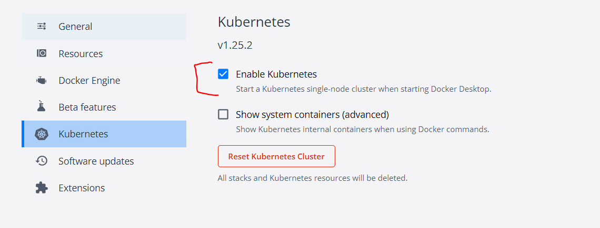
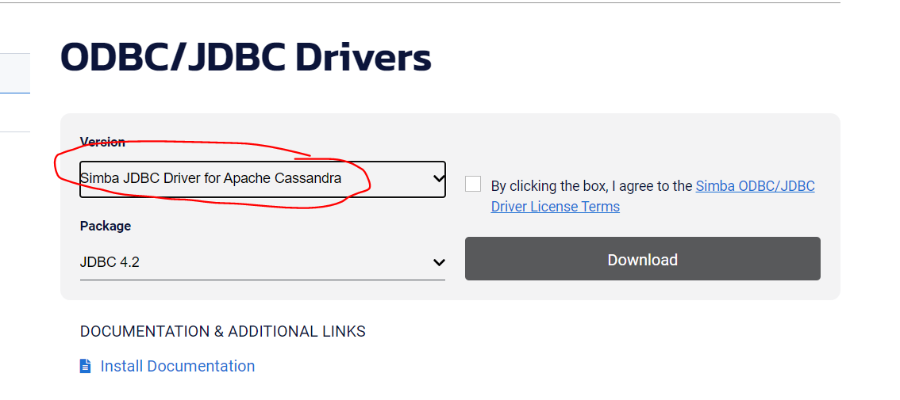
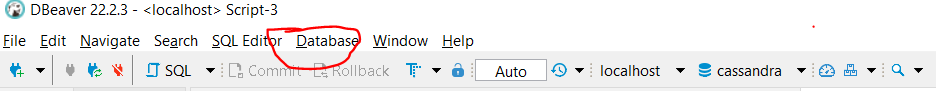
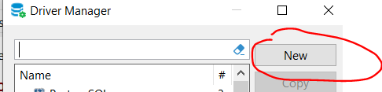
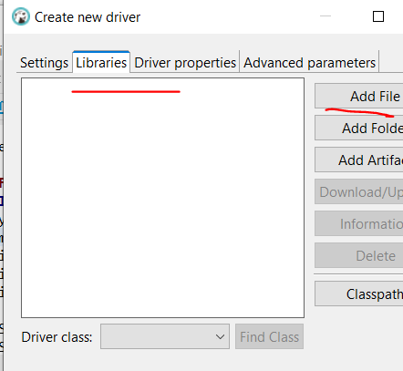
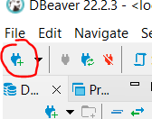
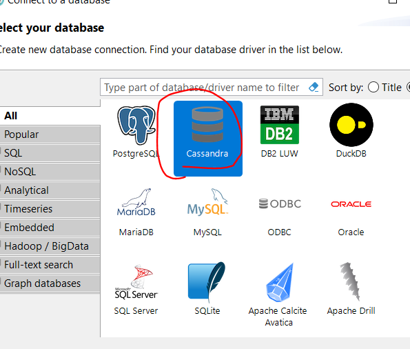

# project_demo

This project is meant to showcase how you can easily build and deploy a small microservices application.
It's an incremental work so I'll be maintaining it every now and then.

It is currently composed of the following tree: 
```
.
├── README.md
├── data-loader ## job to load data from s3 to k8ssandra
│   └── ..
├── docs # docs and screenshots for the documentation
│   └── ..
├── k8ssandra # deployment scripts and steps needed to get k8ssandra up and running
│   └── ..
├── kafka # deployment scripts and steps needed to get kafka up and running
│   ├── ...
├── sbt-builder # builder of sbt image to build scala/spark docker images
│   └── ..
└── schema-manager # builder of a schema manager job that's responsible for creating needed tables and keyspaces on k8ssandra
│   └── ..
├── spark-hadoop # building a spark and hadoop image that has all the needed deps to submit jobs on a cluster
│   └── ..
├── spark-streams # A Consumer that receives data from kafka and stores it in k8ssandra
│   └── ..
```

## Pre-requisites
In order to run this I'm assuming you already installed:

1. docker desktop on your local machine and enabled the kubernetes feature as show by the following screenshot
<p align="center">
  
</p>

2. kubectl command

This is the client control command that we will use to communicate with the kubernetes cluster, here is the [link](https://kubernetes.io/docs/tasks/tools/install-kubectl-linux/) to install it.

3. helm command

The kubernetes package manager command that we will use to add the charts needed to install k8ssandra, here is a [link](https://helm.sh/docs/intro/install/) that you cann follow to install it.

4. Install and Setup DBeaver to access your k8ssandra instance:
 
 * Follow this [link](https://dbeaver.io/download/) to install the tool itself
* Download the JDBC connector from the following [link](https://downloads.datastax.com/#odbc-jdbc-drivers), Make sure you use the dropdown to pick the Driver for Apache Cassandra as shown by the screenshot 
<p align="center">
  
</p>
* Go to DBeaver and click the database dropdown menu as shown in the screenshot and then click "Driver Manager'
<p align="center">
  
</p>

* A new Wizard will open and make sure you click new

<p align="center">
  
</p>
Now fill in the details as follows:

```
- Driver Name: Cassandra
- Driver Type: Generic
- Class Name: com.simba.cassandra.jdbc42.Driver
- URL Template: jdbc:cassandra://{host}[:{port}];AuthMech=1
- Default Port: 9042
```

**Note** 

AuthMech can be set to 0 or 1 depending on whether you enabled or disabled authentication inside your k8ssandra cluster
For my case I'm setting it to 1 as I had authentication enabled (so will be using username and password in my deployment, check k8ssandra for details)

* Click library (Add files) and upload the Cassandra JDBC jar connector and then save

<p align="center">
  
</p>

* Now try clicking the create connection button and you should see cassandra there, click on it and make sure you finish the setup (I've used localhost and 9092 for my setup as I create a load balancer to expose the k8ssandra cluster enttypoint to my localhost, check k8ssandra folder for details)
<p align="center">
  
</p>
<p align="center">
  
</p>
