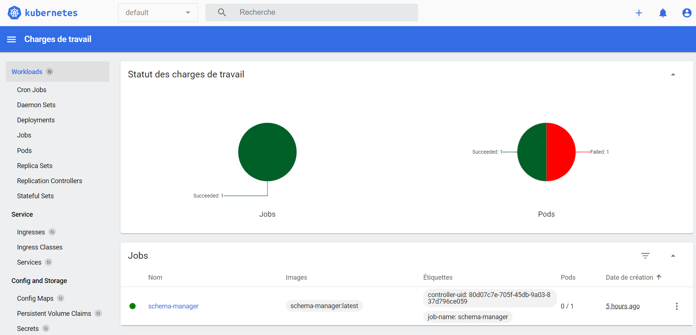

# k8ssandra

In this folder I'll go through the steps you need to follow in order for you to be able to installk8ssandra on your docker desktop


## Pre requisites

To run this you should have:
* docker desktop installed and kubernetes installed
* helm installed
* kubectl installed


## Deployment Steps

1. Create a k8ssandra namespace

```
kubectl create namespace k8ssandra
```

2. Add the k8ssandra helm repo to your local env

```
helm repo add k8ssandra https://helm.k8ssandra.io/stable
helm repo update
```

3. Add the cert-manager helm repo

This is needed to take care of all the certifications needed by k8ssandra

```
helm repo add jetstack https://charts.jetstack.io
helm repo update
helm install cert-manager jetstack/cert-manager --namespace cert-manager --create-namespace --set installCRDs=true
```

Note this will create a namespace called cert-manager and start the needed pods and services under it
(give it a few minute till it starts)


4. Deploy k8ssandra

```
helm install k8ssandra-operator k8ssandra/k8ssandra-operator -n k8ssandra --create-namespace

```

Ìf you didn't create the namespace already as per command 1 this will also create it


5. Create a local-path storageclass as well as the needed permissions and roles for our test
```
kubectl create -f local-path.yaml
```

6. create a cassandra data center

```
kubectl create -f k8c1.yaml -n k8ssandra
```

7. create a k8ssandra loadbalancer


This will expose the k8ssandra dc to your localhost so you can access it through tools like DBeaver (check the source repo [README.md]() for details about how to set this up)

```
kubectl create -f lb.yaml -n k8ssandra
```

8. Start kubernets dashboard to monitor resources

* Installing kubernetes dashboard (it will create a kubernetes-dashboard namespace on your environment)

```
kubectl apply -f https://raw.githubusercontent.com/kubernetes/dashboard/v2.6.1/aio/deploy/recommended.yaml
```

* Enable access to dashboard by running the following command
```
kubectl proxy
```

* Create a token to access the board
```
kubectl -n kubernetes-dashboard create token admin-user
```

* kubernetes dashboard login URL

```
http://localhost:8001/api/v1/namespaces/kubernetes-dashboard/services/https:kubernetes-dashboard:/proxy/#/login
```

<p align="center">
  
</p>
