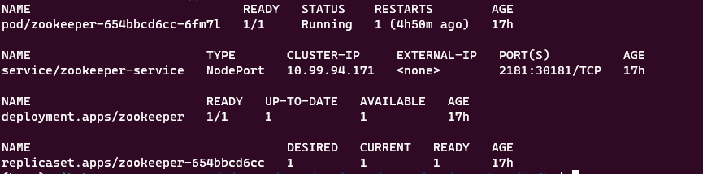
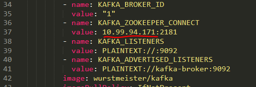
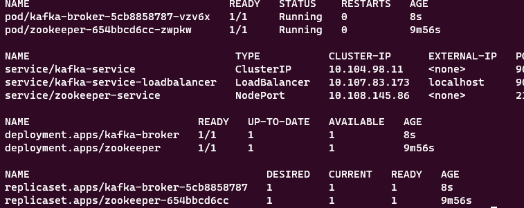

# Deploy a Kafka 

For this example I'll only deploy a broker and a zookeeper on kubernetes and use a shell command line to produce and consume data (and I'll add a producer in the future)

## Depoymeent Steps

1. create \<kafka\> namespace

`kubectl create namespace kafka`

2. create the zookeeper in the \<kafka\> namespace:

`kubectl create -f zookeeper.yaml -n kafka`

You should see the following resources up under kafka namespace using `kubectl get all -n kafka`

<p align="center">
  
</p>

3. create the broker in the \<kafka\> namespace:

Before executing the following command make sure you get the zookeeper-service cluster-ip and add it to line 37 in the broker.yaml file under this variable name KAFKA_ZOOKEEPER_CONNECT

<p align="center">
  
</p>

Create a broker load balancer service by executing `kubectl create -f load_balancer.yaml -n kafka` and copy it's ip under the KAFKA_ADVERTISED_LISTENERS so that you an example would be:
```
        - name: KAFKA_ADVERTISED_LISTENERS
          value: PLAINTEXT://10.103.23.230:9092
```

`kubectl create -f broker.yaml -n kafka`

You should now see the broker up and running

<p align="center">
  
</p>

_____
Now if you want to access the broker using kafkacat right before deplying the streaming application you can keep reading: 


Since we are working locally we will need to edit the <b>/etc/hosts</b> to add the folowing before we continue:

`127.0.0.1   kafka-broker`


4. Install kafkacat command line

This is needed for us to produce and consume data using simple shell commands, follow this [link](https://docs.confluent.io/platform/current/app-development/kafkacat-usage.html#kcat-formerly-kafkacat-utility) to get steup with kafkacat.

5. portforward the kafka broker to localhost

In this step we will expose the kafka broker to localhost so we can query it as if it's not running on a k8s cluster

`
kubectl port-forward -n kafka pod/kafka-broker-${kafka} 9092
`

Instead of a port-forwarding you can also use the load_balancer.yaml file here to expose the same port to localhost [In case you didn't run this already before executing the broker.yaml on k8s]:
```
kubectl create -f load_balancer.yaml -n kafka

```


6. send a stream to kafka using kafkacat

```
echo "dummy" | kafkacat -P -b localhost:9092 -t dummy-topic
```
7. you can try to consume it using

```
kafkacat -C -b localhost:9092 -t dummy-topic
```